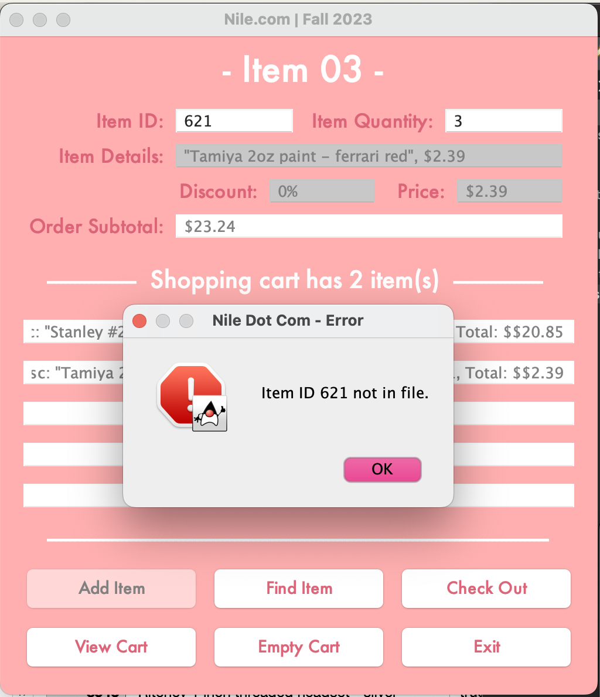

# Nile-GUI
## Overview
This is a java application that is supposed to emulate an online shopping cart.  
## Home Page
This is the clean home page with no values inputted yet. At the top you have all the values inputted and outputted for the indivual item you're looking for. The middle section is your "Shopping Cart" where it lists all the items you've successfully added. And at the bottom there are six buttons, each of which we'll discuss the specifics of later.  
At the top you have to input your desired item ID followed by the quantity of the item. Before inputting these values the "Item Details", "Price", and "Discount" text labels are disabled.  
Also at this point only the "Find Item", "Empty Cart" and "Exit" buttons are enabled. The "Empty Cart" buttons clears any item information in your cart, and the "Exit" button closes the program.   
   
## Find Item
   
   
   
   
## Item Added
   
## Cart
   
## Receipt
   
