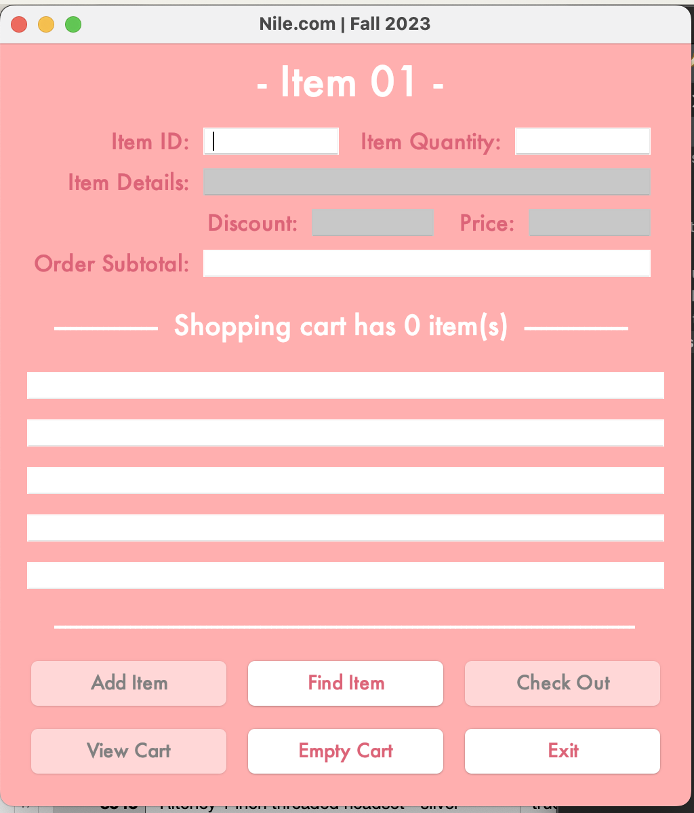

# Nile-GUI
## Overview
This is a java application that is supposed to emulate an online shopping cart using Eclipse and the Java Swing library for the GUI.  
## Home Page
This is the clean home page with no values inputted yet. At the top you have all the values inputted and outputted for the indivual item you're looking for. The middle section is your "Shopping Cart" where it lists all the items you've successfully added. And at the bottom there are six buttons, each of which we'll discuss the specifics of later.  
At the top you have to input your desired item ID followed by the quantity of the item. Before inputting these values the "Item Details", "Price", and "Discount" text labels are disabled.  
Also at this point only the "Find Item", "Empty Cart" and "Exit" buttons are enabled. The "Empty Cart" buttons clears any item information in your cart, and the "Exit" button closes the program.   
   
## Find Item
The "Find Item" button is used to find an item using the type ID to cross reference it with the stock database's item IDs and find a match.  
If you try and find a valid item but the Item ID you gave does not match any from the list, then it will output an error.  
   
If you try to find a valid item but the given amount is higher than what is in stock, it will output an error.  
   
If you try and find a valid item but the item is not in stock, it will output an error.   
   
This is an example of a successfully found item. When an item is found, depending on the amount of product you want, it will display the total price of your order as well as apply to it a percentage discount (Although it is not picutured here).  Also the "Add Item" button is enabled, which allows you to add this item to your cart.   
   
## Item Added
When the "Add Item" is clicked, the item summary will appear in the next open slot of the shopping cart section. You are allowed to have five items total in your cart.   
   
## Cart
If you click the "View Cart" button a popup containing a more detailed and complete version of the shopping cart will show up.  
   
## Receipt
Finally when you're ready to check out you can press the 'Check Out" button which will compile all the purchases you made into a comprehensive reciept. It contains your items as well as the checkout time, number of items, and the total price with all the discounts and taxes applied.   
   
